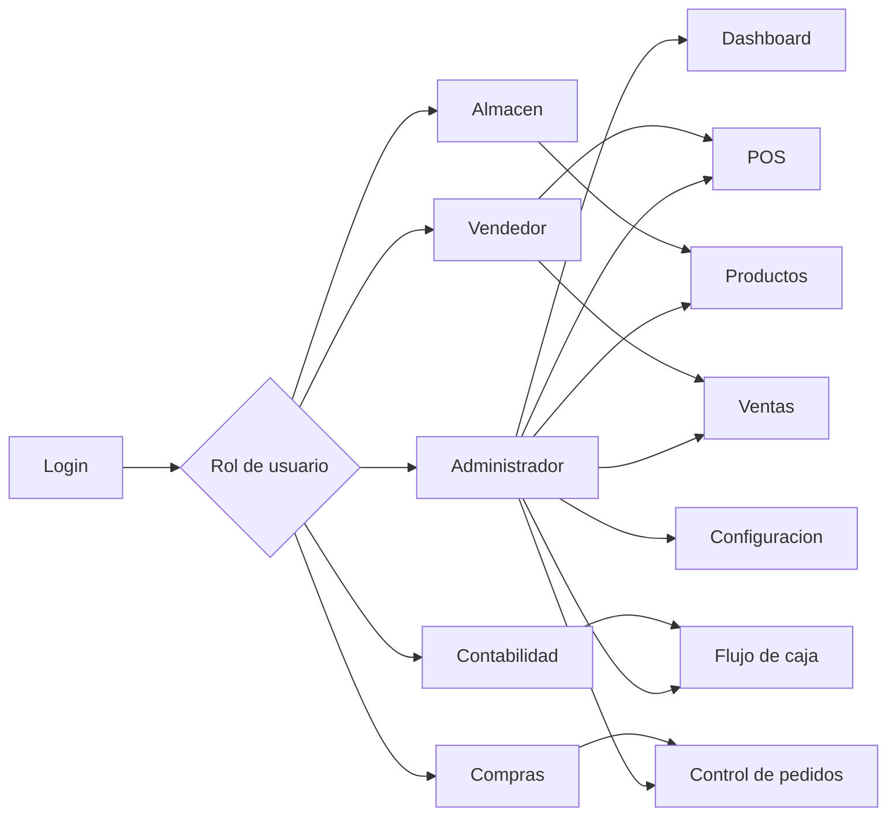
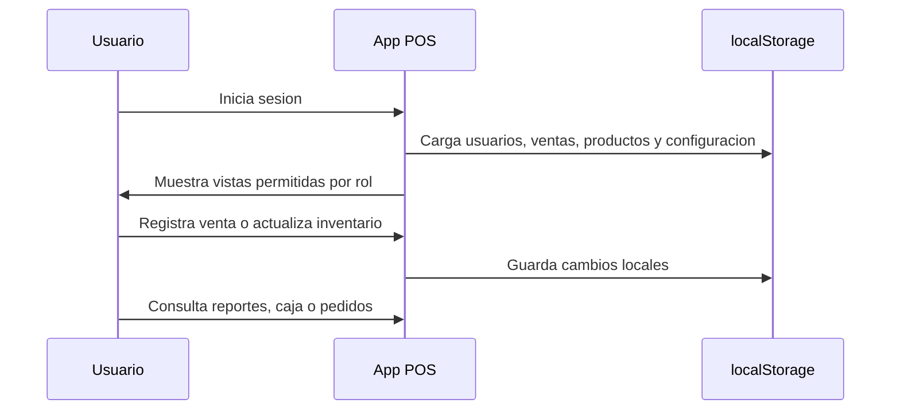
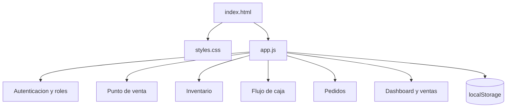

# POS Web


Sistema web de punto de venta para PyMES, orientado a operar ventas, inventario,
flujo de caja, compras, reportes y control de usuarios desde una interfaz ligera
sin backend obligatorio.

> Proyecto MVP funcional. La informacion se guarda localmente en el navegador con
> `localStorage`, por lo que es ideal para demo, validacion operativa o una primera
> version antes de conectar base de datos y API.

## Vista General



## Capacidades Principales

| Area | Funcionalidad |
| --- | --- |
| Punto de venta | Carrito, cobro en efectivo, tarjeta y pago mixto |
| Inventario | Alta, edicion, eliminacion, stock minimo y alertas |
| Ventas | Registro con folio, rango de fechas y vista de ticket |
| Flujo de caja | Capital inicial por caja, ventas, saldo y totales globales |
| Multi-caja | 5 cajas demo con inventario compartido |
| Analitica | KPIs, productos mas vendidos, menor demanda y recomendaciones |
| Compras | Control de pedidos por proveedor y seguimiento operativo |
| Configuracion | Nombre, subtitulo, tema, color de enfasis y logo |
| Seguridad de acceso | Login obligatorio con permisos por jerarquia |
| Datos | Persistencia local y exportacion JSON |

## Flujo Operativo



## Accesos Demo

| Jerarquia | Usuario | Contrasena | Acceso |
| --- | --- | --- | --- |
| Administrador | `UlisesLC` | `5js0qxuh#` | Acceso total |
| Vendedor | `JoseLA` | `Ventas123!` | POS y ventas |
| Almacen | `DanielJ` | `Stock123!` | Productos |
| Compras | `ComprasTP` | `Compras123!` | Control de pedidos |
| Contabilidad | `ContabilidadTP` | `Conta123!` | Flujo de caja |

## Matriz de Permisos

| Vista | Admin | Vendedor | Almacen | Compras | Contabilidad |
| --- | --- | --- | --- | --- | --- |
| Dashboard | Si | No | No | No | No |
| POS | Si | Si | No | No | No |
| Productos | Si | No | Si | No | No |
| Ventas | Si | Si | No | No | No |
| Flujo de caja | Si | No | No | No | Si |
| Control de pedidos | Si | No | No | Si | No |
| Configuracion | Si | No | No | No | No |

## Ejecutar

### Opcion rapida

Abrir `index.html` directamente en el navegador.

### Servidor local

```bash
cd /home/tech_x/Documentos/TPS/PROYECTOS/POS-AI
python3 -m http.server 8080
```

Luego abrir:

```text
http://localhost:8080
```

## Estructura del Proyecto

```text
POS-AI/
|-- index.html      # Estructura de vistas y login
|-- styles.css      # Estilos, responsive y tema visual
|-- app.js          # Logica de negocio, estado, permisos y render
|-- README.md       # Documentacion del proyecto
`-- info/
    `-- DOC.docx
```

## Arquitectura Funcional



## Modulos Incluidos

<details>
<summary><strong>Punto de venta</strong></summary>

- Carrito de productos.
- Cobro en efectivo, tarjeta y pago mixto.
- Redondeo de total: centavos hasta `.50` se cobran en `.50`; arriba de `.50` se cobra al peso completo.
- Asignacion de vendedor por caja.
- Registro de folio, caja, vendedor y metodo de pago.

</details>

<details>
<summary><strong>Inventario y analitica</strong></summary>

- Catalogo editable de productos.
- Alertas de stock minimo.
- Graficas de productos mas vendidos y de menor demanda.
- Recomendaciones de compra, reduccion o descontinuacion.
- Cantidad sugerida segun cobertura de inventario de los ultimos 30 dias.

</details>

<details>
<summary><strong>Flujo de caja</strong></summary>

- Capital inicial por caja.
- Ventas por caja.
- Total acumulado en caja.
- Capital general.
- Saldo global de operacion.

</details>

<details>
<summary><strong>Administracion</strong></summary>

- Login inicial obligatorio.
- Cuentas con jerarquias.
- Control de vistas por rol.
- Exportacion de datos en JSON.
- Configuracion visual del negocio.

</details>

## Roadmap Recomendado

| Prioridad | Mejora | Objetivo |
| --- | --- | --- |
| Alta | API backend | Centralizar usuarios, roles, ventas y caja por turno |
| Alta | Base de datos | Migrar de `localStorage` a PostgreSQL o MySQL |
| Media | Auditoria | Registrar cambios criticos por usuario |
| Media | Tickets PDF | Generar comprobantes imprimibles |
| Media | Impresora termica | Integrar salida directa a punto de venta |
| Baja | Multi-sucursal | Gestionar varias tiendas desde una misma plataforma |
| Baja | Reportes avanzados | Comparativos por periodo, caja, vendedor y categoria |

## Estado del Proyecto

| Item | Estado |
| --- | --- |
| MVP navegable | Listo |
| Login y roles | Listo |
| POS funcional | Listo |
| Flujo de caja | Listo |
| Pedidos | Listo |
| Persistencia local | Listo |
| Backend/API | Pendiente |
| Base de datos real | Pendiente |
